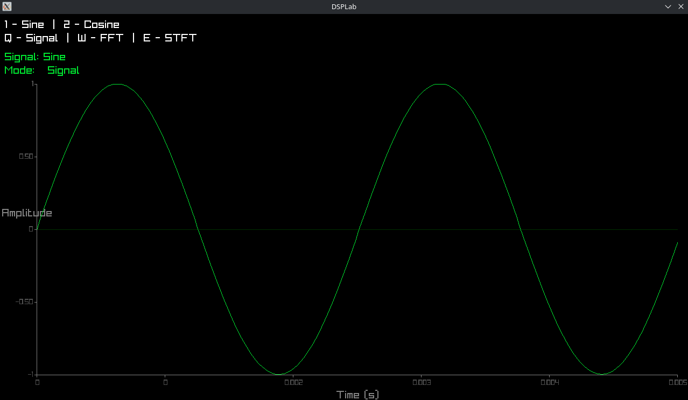

# DSPLab

DSPLab is a digital signal processing laboratory written in modern C++.

The project was created to explore fundamental Digital Signal Processing (DSP) concepts through practical implementation and visualization. Instead of relying on external DSP libraries, core algorithms such as Fast Fourier Transform (FFT) and Short-Time Fourier Transform (STFT) are implemented from scratch to better understand their internal mechanics.

DSPLab allows users to generate signals, perform spectral analysis, and visualize both time-domain and frequency-domain representations through an interactive graphical interface.

> This project is primarily educational and research-oriented, focusing on algorithm implementation, software architecture, and modern C++ development practices.



---

## Features

* Signal generation
* Signal processing and manipulation
* Fast Fourier Transform (FFT)
* Short-Time Fourier Transform (STFT)
* Time-domain signal visualization
* Frequency-domain spectrum visualization
* Spectrogram visualization
* Interactive graphical user interface

---

## Motivation

Digital Signal Processing is used in a wide range of domains, including:

* Audio and music processing
* Telecommunications
* Scientific computing
* Embedded systems
* Radar and sensor systems
* Data analysis

The goal of DSPLab is to provide a compact environment for experimenting with DSP algorithms while serving as a learning project focused on:

* Modern C++ development
* Algorithm implementation
* Numerical computing
* Data visualization
* Software architecture
* Cross-platform development

---

## Technology Stack

* C++17
* Meson
* Ninja
* Clang
* Raylib

---

## Why Meson?

The project uses Meson as its build system together with Ninja.

Reasons for choosing Meson:

* Simple and readable configuration files
* Fast project configuration and compilation
* Excellent support for modern C++ projects
* Convenient integration with Clang and development tools
* Less boilerplate compared to traditional build systems

Meson provides a clean and maintainable development workflow, making it a good fit for small and medium-sized C++ projects.

---

## Dependencies

The project requires:

* C++17 compatible compiler
* Clang
* Meson
* Ninja
* Raylib

### Arch Linux

```bash
sudo pacman -S meson ninja clang raylib
```

### Ubuntu

```bash
sudo apt update

sudo apt install -y \
    clang \
    meson \
    ninja-build 
```

Raylib may not be available in all Ubuntu repositories. If required, install it manually or build it from source.

---

## Build & Run

### Configure the project

Run once after cloning the repository:

```bash
CC=clang CXX=clang++ meson setup build
```

### Compile

Rebuild after making changes:

```bash
meson compile -C build
```

### Run

```bash
./build/start
```

---

## Project Structure

```text
DSPLab
│
├── main.cpp
│
├── core
│   ├── Signal
│   │   └── Signal.cpp
│   │
│   ├── Processing
│   │   ├── SignalOps.cpp
│   │   ├── FFT.cpp
│   │   └── STFT.cpp
│   │
│   └── Generators
│       ├── Generator.cpp
│       └── SineGenerator.cpp
│
└── ui
    └── App.cpp
```

### Core Components

#### Signal

Provides the fundamental signal representation and storage.

#### SignalOps

Contains operations and transformations applied to signals.

#### FFT

Implementation of the Fast Fourier Transform for frequency-domain analysis.

#### STFT

Implementation of the Short-Time Fourier Transform for time-frequency analysis and spectrogram generation.

#### Generators

Signal generators used for creating test and demonstration signals.

#### UI

Graphical user interface and visualization layer.

---

## Example Workflow

1. Generate a signal.
2. Apply signal processing operations.
3. Perform FFT analysis.
4. Perform STFT analysis.
5. Visualize the results.
6. Explore signal behavior in both time and frequency domains.

---

## Future Improvements

* Additional signal generators
* More window functions for STFT
* Improved spectrogram rendering
* Signal export functionality
* Real-time signal analysis
* External data import support

---

## Development Environment

Primary development environment:

* Arch Linux
* Clang++
* Meson
* Ninja

The project is intended to remain portable across Linux systems and can be adapted to other platforms with minimal changes.

---

## License

This project is distributed under the MIT License.

---

## Author

Created as a personal learning and research project focused on:

* Digital Signal Processing
* Modern C++
* Numerical Algorithms
* Software Engineering
* Interactive Visualization
